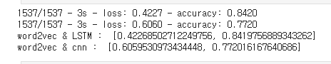
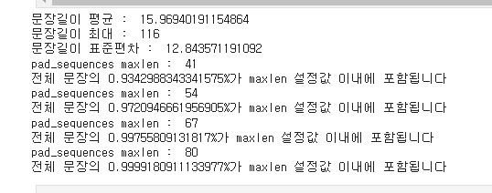
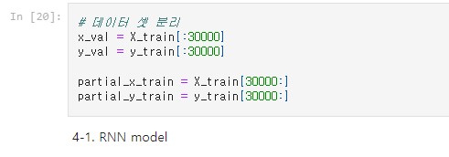
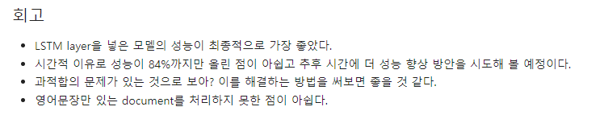

🔑 **PRT(Peer Review Template)**
- 코더 : 이서진
- 리뷰어 : 신재현

- [x]  **1. 주어진 문제를 해결하는 완성된 코드가 제출되었나요? (완성도)**
    - 문제에서 요구하는 최종 결과물이 첨부되었는지 확인
    문제에서 요구하는 감정분석 모델, word2vec을 활용한 성능 개선 파트에서 확연히 비교되는 결과물을 첨부하였습니다.
    - 문제를 해결하는 완성된 코드란 프로젝트 루브릭 3개 중 2개, 
    퀘스트 문제 요구조건 등을 지칭
    1. 여러 모델을 활용하여 태스크를 구현하셨습니다.
    2. gensim을 활용하여 자체학습된 레이어를 분석하셨습니다.
    3. 아쉽지만 84.6프로로 85프로는 달성하지 못했습니다.
        - 해당 조건을 만족하는 부분의 코드 및 결과물을 캡쳐하여 사진으로 첨부
        

- [x]  **2. 프로젝트에서 핵심적인 부분에 대한 설명이 주석(닥스트링) 및 마크다운 형태로 잘 기록되어있나요? (설명)**
    
    여기서는 세부적인 튜닝 사유나 모델 구성에 대한 부분으로 예상되는데, 사진에서 볼 수 있듯이 전체 문장 길이를 구하는 것에도 여러 방식을 통해서 결정하시는 등 세심한 요소들을 볼 수 있습니다.

- [x]  **3. 체크리스트에 해당하는 항목들을 모두 수행하였나요? (문제 해결)**
    - [X]  데이터를 분할하여 프로젝트를 진행했나요? (train, validation, test 데이터로 구분)
    아래 사진 첨부
    - [X]  하이퍼파라미터를 변경해가며 여러 시도를 했나요? (learning rate, dropout rate, unit, batch size, epoch 등)
    네 여러 모델 구성 요소들을 바꿔가며 진행하셨습니다.
    - [x]  각 실험을 시각화하여 비교하였나요?
    네, 하부 그래프들을 보더라도 시각화를 엄청 잘하셨습니다.
    (종류가 너무 많아 사진보다 ipynb를 빠르게 보는게 더 빠를거 같아 사진 첨부하진 않았습니다)
    - [x]  모든 실험 결과가 기록되었나요?
    

- [x]  **4. 프로젝트에 대한 회고가 상세히 기록 되어 있나요? (회고, 정리)**
    - [x]  배운 점
    - [x]  아쉬운 점
    - [x]  느낀 점
    - [x]  어려웠던 점

## 총평

전반적으로 어려운 nlp 프로젝트 속에서 프로젝트를 성공적으로 완수하신게 대단하십니다. 초반 전체 글자 수를 선택함에 있어 ipynb에는 잘 안들어간거 같지만 설명시간때 왜 이렇게 설정했는지 어떤 것들을 고려했는지(패딩의 개수, 위치, 훈련 데이터 성질)를 들었어서 흥미롭게 들었습니다.
